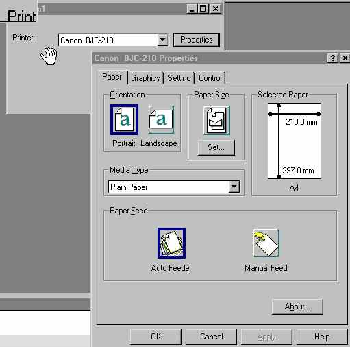



## Display the Printer properites dialog box

### Description

This sample code shows the way to show the printer properties window, That is the dialog box to set the optios of a printer, using API and not the VB Common Dialog.

Very Fast and easy to use

Uses the OpenPrinter,PrinterProperties and ClosePrinter API functions
 
### More Info
 

             |
---                |---
**Submitted On**   |2000-10-17 10:13:30
**By**             |[JA](https://github.com/Planet-Source-Code/PSCIndex/blob/master/ByAuthor/ja.md)
**Level**          |Advanced
**User Rating**    |3.8 (34 globes from 9 users)
**Compatibility**  |VB 6\.0
**Category**       |[Windows API Call/ Explanation](https://github.com/Planet-Source-Code/PSCIndex/blob/master/ByCategory/windows-api-call-explanation__1-39.md)
**World**          |[Visual Basic](https://github.com/Planet-Source-Code/PSCIndex/blob/master/ByWorld/visual-basic.md)
**Archive File**   |[CODE\_UPLOAD1077510192000\.zip](https://github.com/Planet-Source-Code/ja-display-the-printer-properites-dialog-box__1-12146/archive/master.zip)

